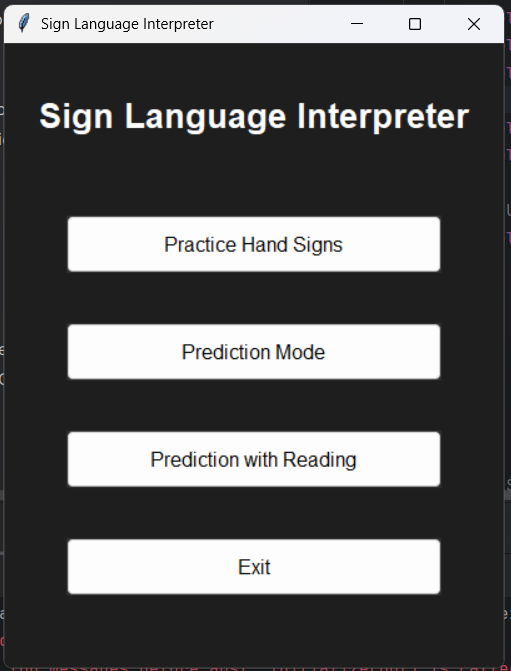
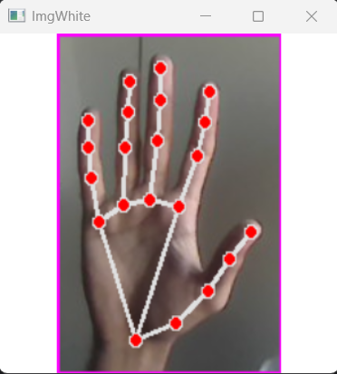
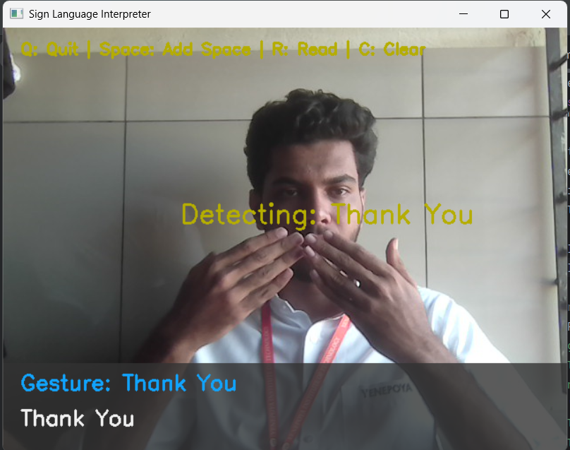

# 🤟 Sign Language Interpreter

A real-time assistive communication tool that leverages computer vision and deep learning to recognize American Sign Language (ASL) alphabet gestures and convert them into readable text and spoken English using text-to-speech (TTS).

---

## 🚀 Initial Commit: Sign Language Interpreter v1.0.0

✨ **Features:**
- Three operation modes:  
  - 🧠 **Practice Mode** for learning and refining gestures  
  - 📖 **Prediction Mode** for forming words and sentences  
  - 🔊 **Prediction with Reading Mode** for full-text-to-speech interaction
- Real-time gesture recognition using OpenCV and MediaPipe
- Pre-trained CNN-based gesture classifier for ASL alphabet (except J and Z)
- Stability threshold (1 sec) to reduce false positives
- Tkinter GUI with dark theme and interactive controls
- Intelligent image preprocessing for better recognition (resizing, ROI cropping, white background)
- Text accumulation and audio output using pyttsx3 or gTTS

🛠️ **Tech Stack:**
- **Python 3.8+**
- **OpenCV + MediaPipe** for gesture detection and tracking
- **TensorFlow / Keras** for gesture classification
- **Tkinter** for the desktop interface
- **pyttsx3 / gTTS** for text-to-speech
- **cvzone** for simplified hand tracking
- **NumPy**, **Pandas** for data management

---

## 📂 Project Structure

```
sign-language-interpreter/
│
├── Data/                       # Individually captured custom images for model training
├── Model/                      # Custom-trained ASL gesture classification model using Teachable Machine
├── demo/                       # Sample Output Images
├── src/
│   ├── mainGUi.py               # Entry point of the system
│   └── detection.py             # Gesture detection logic using MediaPipe
│
├── requirements.txt             # All required Python dependencies
└── README.md                    # This file
```

---

## 💡 How It Works

1. **Live Feed**: Captures hand gestures in real-time using a standard webcam.
2. **Detection & Tracking**: MediaPipe and OpenCV track and isolate the hand region.
3. **Preprocessing**: Images are normalized and formatted on a white canvas.
4. **Gesture Classification**: CNN model identifies static ASL gestures.
5. **Translation Logic**: Depending on mode, text is accumulated and optionally converted to speech.
6. **User Interface**: Users interact via an intuitive Tkinter GUI to select modes and view outputs.

---

## 🖥️ Installation & Setup

```bash
# Clone the repository
git clone https://github.com/affan-jamal/_Linguoscope_-Sign-language-interpreter-.git
cd _Linguoscope_-Sign-language-interpreter-

# Create a virtual environment
python -m venv venv
source venv/bin/activate      # On Windows: venv\Scripts\activate

# Install dependencies
pip install -r requirements.txt

# Run the image capture script
python src/data_collection.py   #This will open the camera window with hand landmarks for image capture for model training

# Store the imaged in seperate directory inside Data folder

# Run the system
python src/mainGUi.py
```

---

## 📦 Requirements

```
opencv-python
mediapipe
cvzone
tensorflow
numpy
pandas
pyttsx3 or gTTS
tkinter (comes pre-installed with Python)
```

---

## 📈 Future Enhancements

- 🧠 Support dynamic signs (J and Z) using LSTM/Transformer-based models
- 🌍 Extend to British Sign Language (BSL), Indian Sign Language (ISL)
- 📱 Mobile/web deployment using React Native or Flask
- 🤖 Add facial emotion detection for richer context
- ☁️ Cloud sync & user personalization for adaptive learning

---

## 👨‍💻 Author

- **Affan Jamal**    
  Department of Computer Science and Engineering  
  Yenepoya Institute of Technology, Mangalore  
  [LinkedIn](www.linkedin.com/in/affan004) • [GitHub](https://github.com/Affan-04)

---

## 🧪 Demo Screenshots

| User Interface | Gesture Capture | Gesture Detection |
|:-------------:|:---------------:|:------------------------:|
|  |  |  |

---

> Built with ❤️ to bridge the communication gap and empower accessibility for all.
